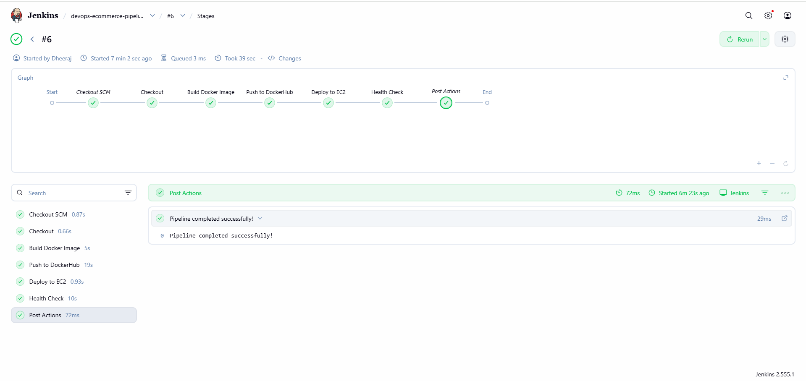
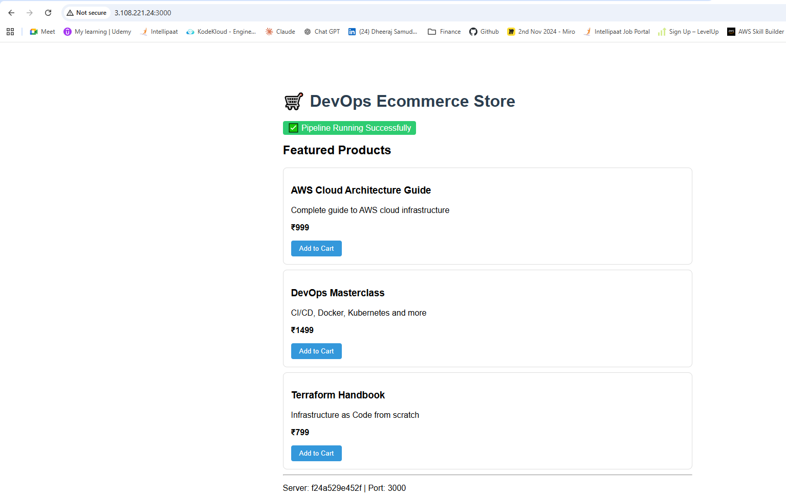
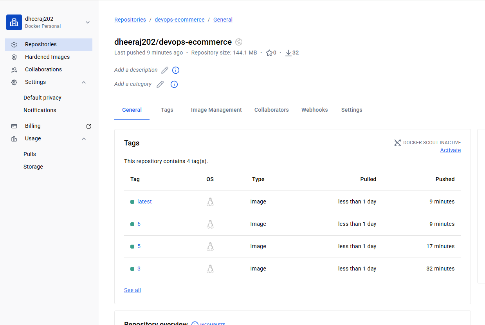
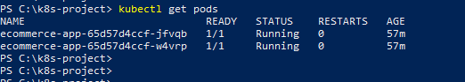
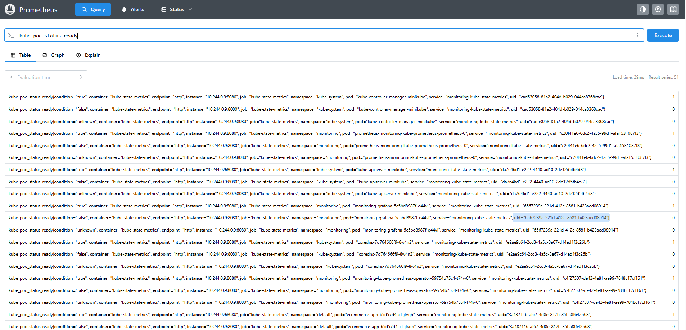
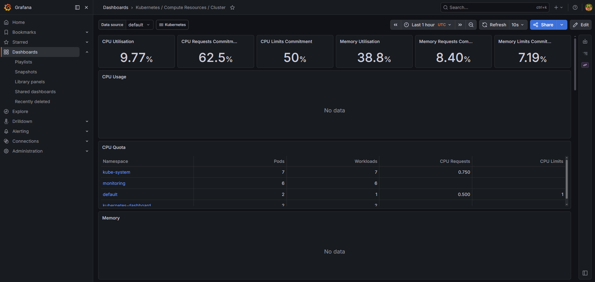

# 🚀 DevOps Ecommerce Project — End-to-End CI/CD Pipeline

## 📌 Project Overview
A production-grade DevOps project demonstrating complete CI/CD automation
from code commit to live deployment on AWS EC2 using Jenkins and Docker.

## 🏗️ Architecture

GitHub Push → Jenkins Pipeline → Docker Build → DockerHub → AWS EC2 Deploy → Health Check ✅

## 🔧 Tech Stack
| Tool | Purpose |
|---|---|
| **Jenkins** | CI/CD Pipeline Automation |
| **Docker** | Containerization |
| **GitHub** | Source Code Management |
| **AWS EC2** | Cloud Deployment |
| **DockerHub** | Container Registry |
| **Node.js/Express** | Application Framework |

## 🔄 Pipeline Stages
1. ✅ **Checkout** — Pull latest code from GitHub
2. ✅ **Build** — Create versioned Docker image
3. ✅ **Push** — Upload image to DockerHub
4. ✅ **Deploy** — Run container on AWS EC2
5. ✅ **Health Check** — Verify live endpoint

## 📸 Screenshots
### Jenkins Pipeline — All Stages Green


### Live Application on AWS EC2


### DockerHub — Versioned Images


## 🚀 How to Run Locally
```bash
# Pull and run the Docker image directly
docker run -d -p 3000:3000 dheeraj202/devops-ecommerce:latest

# Access the app
http://localhost:3000
```

## 📝 Key Files
| File | Purpose |
|---|---|
| `Jenkinsfile` | Complete pipeline definition (IaC) |
| `Dockerfile` | Container build instructions |
| `app.js` | Node.js Express application |
| `package.json` | Dependencies |

## 💡 What I Learned
- Setting up Jenkins inside Docker for clean, portable CI/CD
- Writing declarative Jenkinsfile pipelines
- Securing credentials using Jenkins Credentials Manager
- Automating Docker build, tag, push, and deploy workflows
- Implementing health checks in deployment pipelines

---

## 🔥 Project 2 — Kubernetes + Prometheus + Grafana Monitoring

### What's Running
- Ecommerce app deployed on Kubernetes with **2 replicas**
- Full observability via **Prometheus + Grafana** installed using Helm

### Live Metrics
- CPU Utilisation: **9.77%**
- Memory Utilisation: **38.8%**
- Pods monitored across: default, monitoring, kube-system namespaces

### Screenshots




### Stack
`Kubernetes` `Helm` `Prometheus` `Grafana` `Docker` `kubectl` `PromQL`

## 👤 Author
**Dheeraj Samudrala** — DevOps Engineer
- 🔗 LinkedIn: linkedin.com/in/dheeraj-samudrala-b99b9540
- 🐙 GitHub: github.com/DheerajSam
- 📧 dheeraj.workfolio@gmail.com
